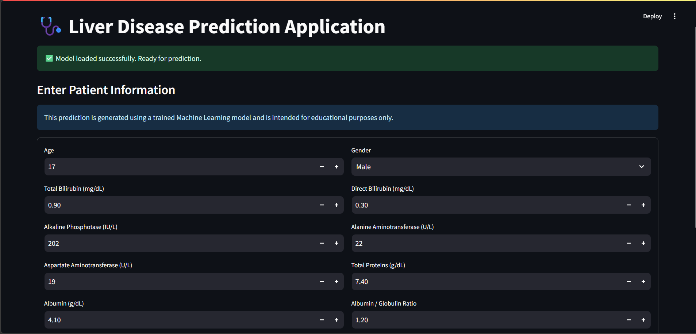
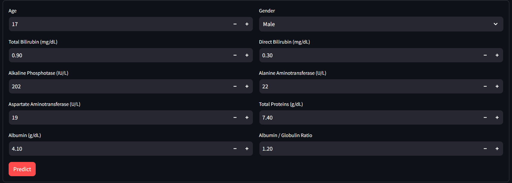
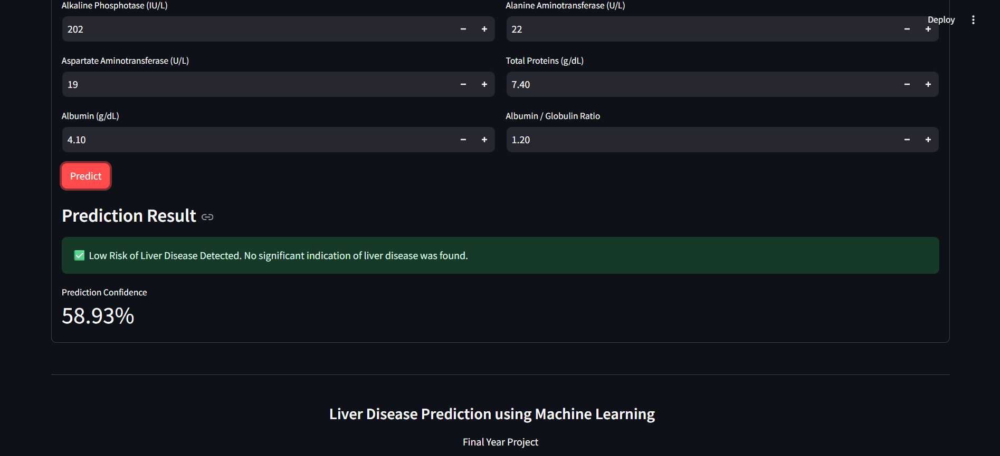

# 🩺 Liver Disease Prediction using Machine Learning

## 📌 Project Overview

This project predicts whether a patient is likely to have liver disease using Machine Learning techniques. The Indian Liver Patient Dataset (ILPD) was used for training and evaluation. Multiple classification algorithms were compared, and the best-performing model was selected for deployment using Streamlit.

---

# 🎯 Objective

- Predict the likelihood of liver disease.
- Compare multiple Machine Learning algorithms.
- Improve model performance using Hyperparameter Tuning.
- Deploy the final model as a user-friendly web application.

---

# 📊 Dataset

**Dataset Name:** Indian Liver Patient Dataset (ILPD)

**Source:** UCI Machine Learning Repository

**Total Records:** 583

**Total Features:** 10 Input Features + 1 Target

### Input Features

- Age
- Gender
- Total Bilirubin
- Direct Bilirubin
- Alkaline Phosphotase
- Alanine Aminotransferase (ALT)
- Aspartate Aminotransferase (AST)
- Total Proteins
- Albumin
- Albumin and Globulin Ratio

### Target Variable

| Value | Meaning |
|-------|---------|
| 1 | Liver Disease |
| 0 | No Liver Disease |

---

# ✨ Features

- User-friendly Streamlit Interface
- Patient Health Data Input Form
- Real-time Liver Disease Prediction
- Prediction Confidence Score
- Random Forest Classifier
- Hyperparameter Tuned Model
- Responsive and Clean UI

---

# 🔍 Exploratory Data Analysis (EDA)

- Data Inspection
- Missing Value Handling
- Gender Encoding
- Statistical Summary
- Feature Distribution Analysis
- Correlation Matrix
- Outlier Detection
- Class Distribution Analysis

---

# 🤖 Machine Learning Models

- Logistic Regression
- Decision Tree
- Random Forest
- K-Nearest Neighbors (KNN)
- Support Vector Machine (SVM)

---

# ⚙️ Hyperparameter Tuning

GridSearchCV with 5-Fold Cross Validation was used to optimize all machine learning models.

Evaluation Metrics:

- Accuracy
- Precision
- Recall
- F1 Score
- ROC-AUC Score

---

# 🏆 Final Model

**Random Forest Classifier**

### Best Parameters

- Bootstrap = True
- Criterion = Entropy
- Max Depth = 5
- Max Features = sqrt
- Min Samples Split = 2
- Min Samples Leaf = 1
- Number of Trees = 100

---

# 📈 Final Performance

| Metric | Score |
|---------|-------|
| Accuracy | 71.93% |
| Precision | 72.48% |
| Recall | 97.53% |
| F1 Score | 83.16% |
| ROC-AUC | 79.42% |

---

# 🖥 User Interface

The application provides a simple and interactive interface where users can enter patient information and instantly receive a prediction along with the confidence score.

### Main Features

- Patient Information Form
- One-click Prediction
- Prediction Confidence
- Medical Disclaimer
- Responsive Layout

---

# 📷 Application Screenshots

## Home Page

> *(Add screenshot here)*



---

## Patient Input Form

> *(Add screenshot here)*



---

## Prediction Result

> *(Add screenshot here)*




---

# 🚀 Deployment

The application is deployed using **Streamlit**.

Users can:

- Enter patient details
- Predict liver disease
- View prediction confidence
- Receive an easy-to-understand result

---

# 🛠 Technologies Used

- Python
- Pandas
- NumPy
- Scikit-learn
- Streamlit
- Matplotlib
- Seaborn
- Joblib

---

# 📂 Project Structure

```text
Project/
│
├── data/
├── models/
├── notebooks/
├── scripts/
├── Util/
│   └── util.py
├── main.py
├── requirements.txt
└── README.md
```

---

# ▶️ Run Locally

```bash
pip install -r requirements.txt

streamlit run main.py
```

---

# 📌 Future Improvements

- Improve prediction accuracy using larger datasets.
- Add Explainable AI (SHAP/LIME).
- Enable batch prediction using CSV upload.
- Deploy on cloud platforms.
- Integrate with hospital management systems.

---

# 👨‍💻 Author

**Yaswanth Pusuluri**